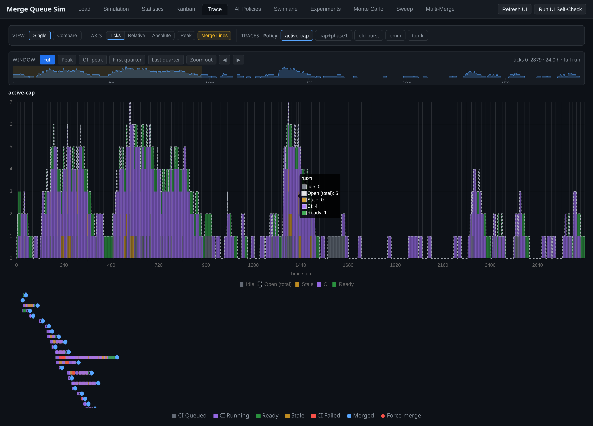
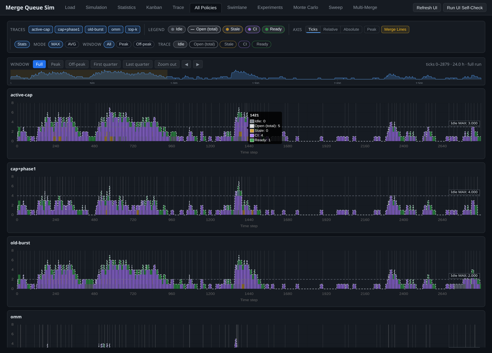
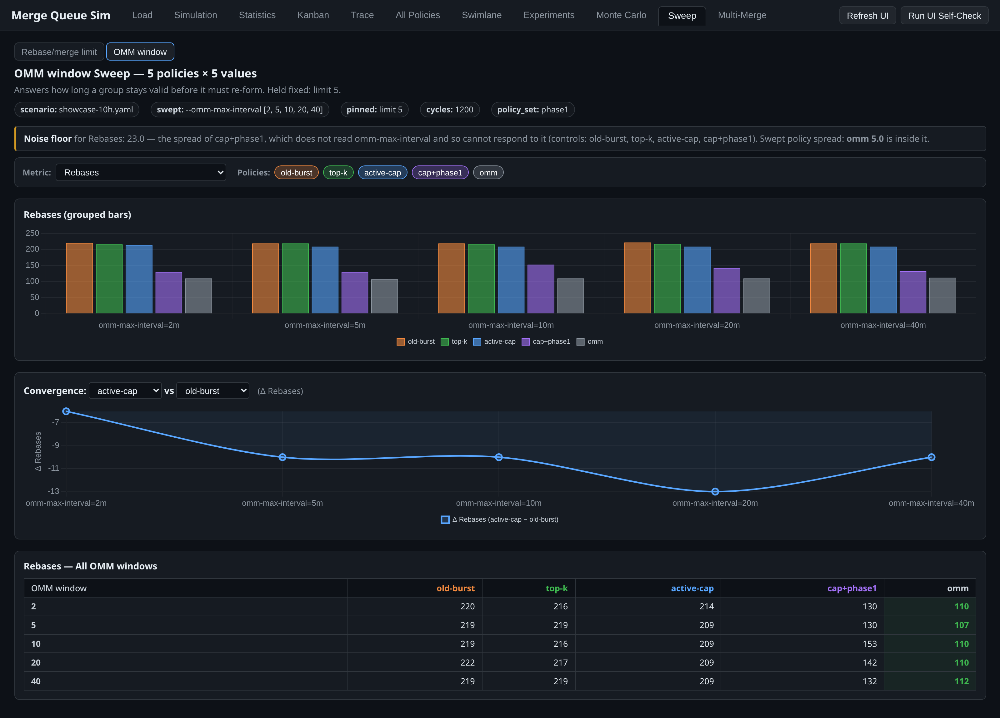

# UI tour

Every reachable view, sub-view and interaction state of [ui/index.html](../ui/index.html),
captured from one 24h run of `scenarios/showcase-10h.yaml` across five policies.

The captures are automated and deterministic: fixed viewport and device scale,
Chart.js animation disabled before first render, the playhead parked on one
tick, and every wait a predicate poll rather than a sleep. Re-running the
capture on unchanged data reproduces the same bytes.

Open the UI on this data yourself with `make ui`.

## Load

Drag NDJSON in, or point the run browser at a `reports/` directory. Parsing and
rendering happen in the browser; nothing is uploaded.

## Statistics — the verdict

Throughput is 4.502
merges/hour for three of five policies and 108 MRs merged for four of five —
read that alone and nothing happened. The same run moves the median MR from
14m to 9m and the p95 tail from 1h21m to 15m.

Both sides are selectable; the baseline defaults to `old-burst`, the pre-OMM
production policy.

Extended mode separates peak from off-peak. A policy that looks equivalent over
24h can differ inside the peak window.

Per-priority, because an average hides whether the tail belongs to
low-priority work or to everyone.

## Kanban — the replay

One card per merge request, one board per policy, one playhead across all of
them. This is the only surface that follows the playhead — everything else
reads a finished run.

## Trace, All Policies, Swimlane

Shared y axis, so panel heights are comparable rather than each self-scaled.

### Windowing a long run

A 24h run at 30s ticks is 2880 columns. Everything renders, but one CI pipeline
is under half a pixel wide.

Drag the overview strip or take a preset. The window is global, so the Trace,
All Policies and Swimlane tabs stay comparable. A windowed swimlane drops lanes
with nothing inside the window, and the All Policies stat lines and y axis are
clipped to it — a mean drawn across a peak-only view but computed over all 24
hours would state something false.

### Interaction states

The scrubber is bounded to the MR's own first and last event, so scrubbing
cannot leave the lane.

## Simulation

A scenario promoted from real logs carries its targets. This view is where a
run says whether it reproduced them.

## Experiments

Which scenarios actually tell two policies apart, so a comparison is not run on
a scenario where every policy scores the same.

## Monte Carlo

Repeated trials, because a single run's winner can be noise.

## Sweep

Each document varies one parameter and pins the other. The noise-floor line
names the policies that **cannot** read the swept flag — their spread across the
axis is this scenario's run-to-run noise, and any claimed effect has to clear
it. On the OMM window axis every policy but `omm` is a control.

## Multi-Merge

Optimistic multi-merge only helps when consecutive merges touch different
services. These views measure that independence rate on the loaded data.
